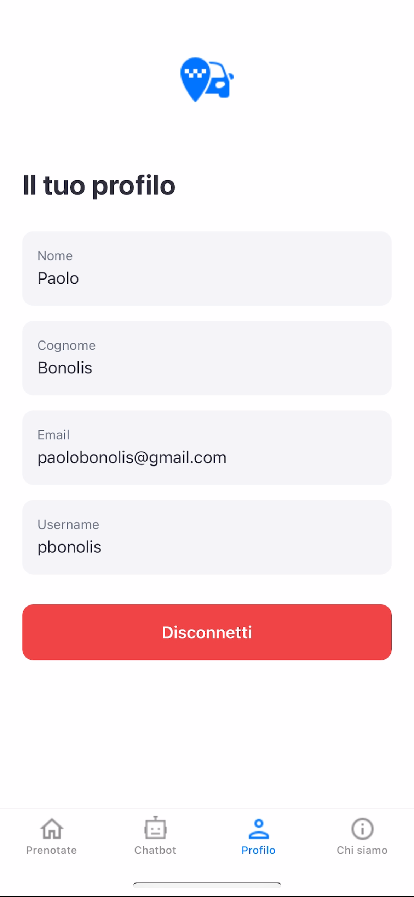
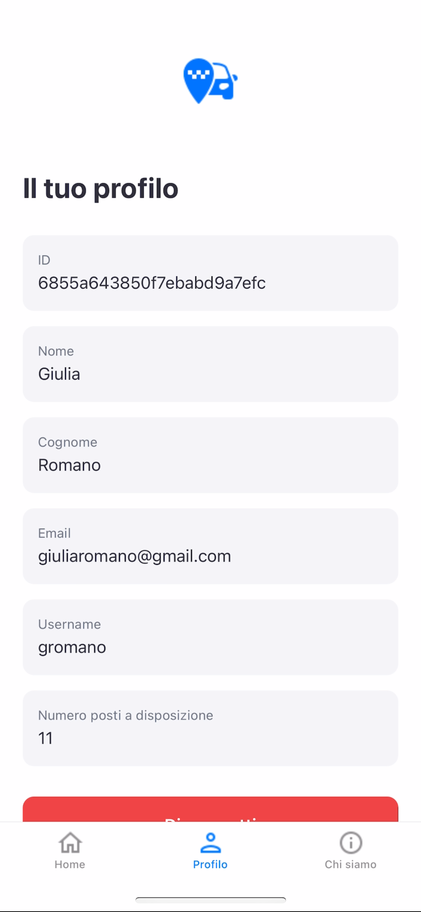
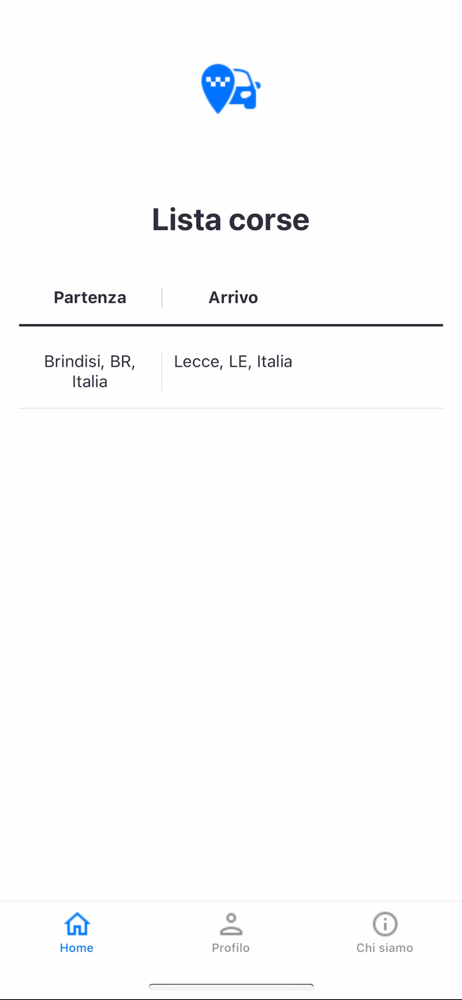

#Taxi Sociale App – Progetto IoT 2024/2025

## Descrizione del progetto

Questo progetto nasce con l'obiettivo di sviluppare una piattaforma intelligente e user-friendly per la gestione e la prenotazione di corse condivise, pensata per favorire la mobilità sostenibile e la collaborazione tra utenti.

L'applicazione consente agli utenti di:

- Registrarsi come passeggeri o autisti;
- Prenotare corse disponibili;
- Visualizzare in tempo reale lo stato delle proprie prenotazioni;
- Interagire tramite chatbot;
- Gestire il proprio profilo personale.

La soluzione è progettata per garantire:

- Facilità d'uso, con un'interfaccia intuitiva e accessibile;
- Sicurezza nella gestione dei dati personali e delle transazioni;
- Scalabilità, per supportare un numero crescente di utenti e corse;
- Integrazione con servizi di notifica, via email, per aggiornamenti in tempo reale.

## Architettura del Sistema

Il sistema si basa su un'architettura modulare, composta da un backend (microservizi) e un'applicazione mobile sviluppata in React Native, ottimizzata per dispositivi Android e iOS.

  

### Componenti principali

- **UserServiceProject**: Gestione degli utenti, autenticazione, autorizzazione e aggiornamento dei dati di profilo.
- **TripServiceProject**: Gestione delle corse, creazione, prenotazione, cancellazione e visualizzazione delle corse disponibili.
- **ModelServiceProject**: Supporto agli utenti tramite chat integrata per domande frequenti e assistenza.
- **Frontend**: Applicazione React Native per la fruizione dei servizi da parte degli utenti.

## Repositori dei componenti

- UserServiceProject: [UserServiceProject](https://github.com/UniSalento-IDALab-IoTCourse-2024-2025/wot-project-2024-2025-UserServiceProject-RobertiGolia)
- TripServiceProject: [TripServiceProject](https://github.com/UniSalento-IDALab-IoTCourse-2024-2025/wot-project-2024-2025-TripServiceProject-RobertiGolia)
- ModelServiceProject: [ModelServiceProject](https://github.com/UniSalento-IDALab-IoTCourse-2024-2025/wot-project-2024-2025-ModelServiceProject-RobertiGolia)

## FrontEnd

L'applicazione mobile, sviluppata in React Native, permette agli utenti di:

- Visualizzare e prenotare corse disponibili;
- Gestire il proprio profilo e le proprie prenotazioni;
- Ricevere notifiche in tempo reale tramite email;
- Interagire con un chatbot per assistenza rapida.

L'interfaccia è progettata per essere semplice e intuitiva, con schermate dedicate alla visualizzazione delle corse, alla gestione del profilo. Il codice è organizzato in moduli e componenti riutilizzabili, facilitando la manutenzione e l'estensione futura.

### Schermata Profilo

Nella schermata profilo, l'utente può visualizzare i propri dati personali. Se l'utente è un autista, può visualizzare le corse proposte.

  
  

### Schermata Corse

Nella sezione corse, è possibile visualizzare tutte le corse disponibili, prenotare una corsa o proporne una nuova.

  
  

